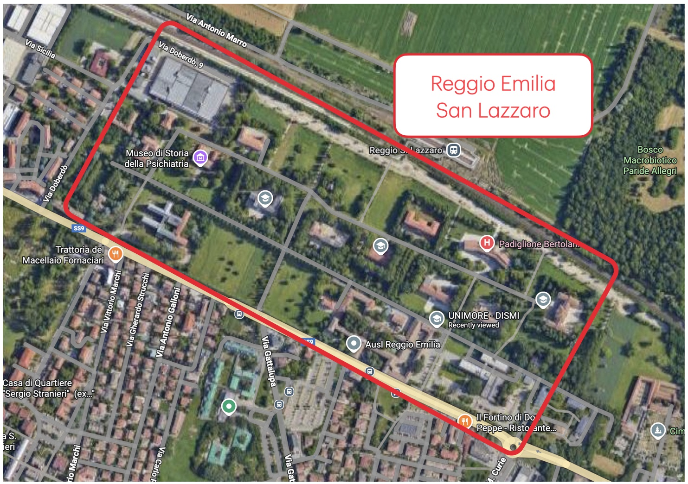
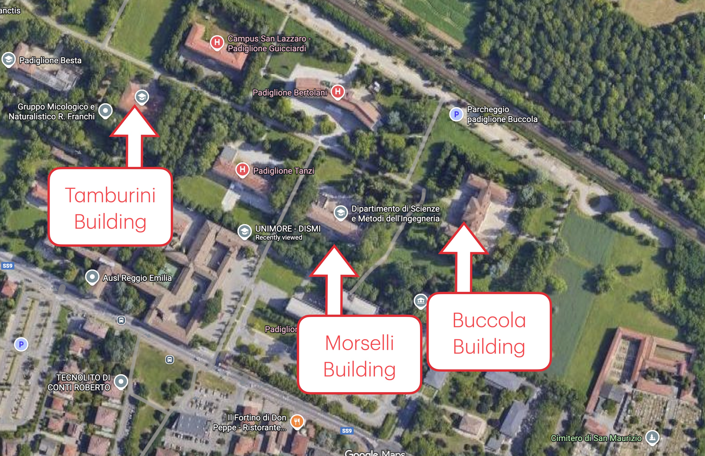
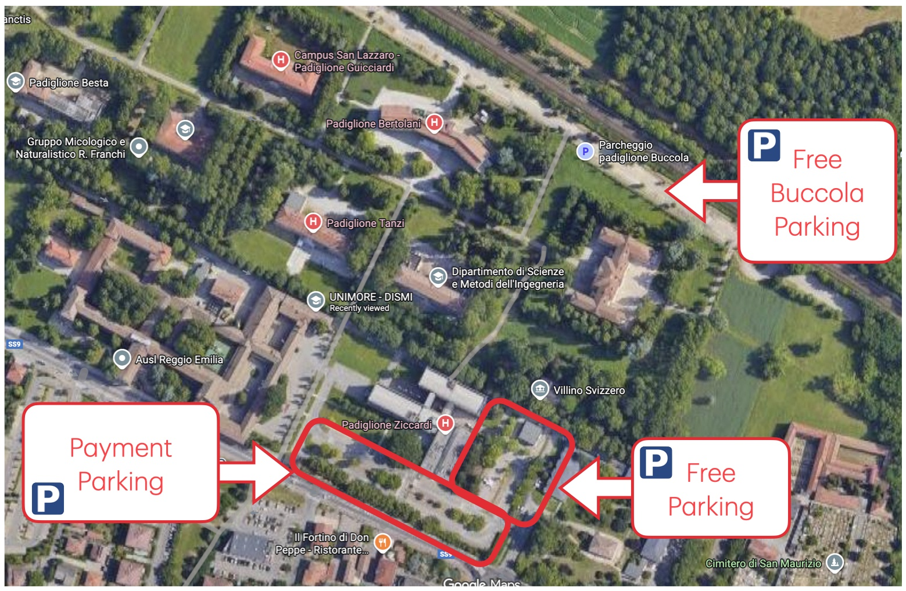
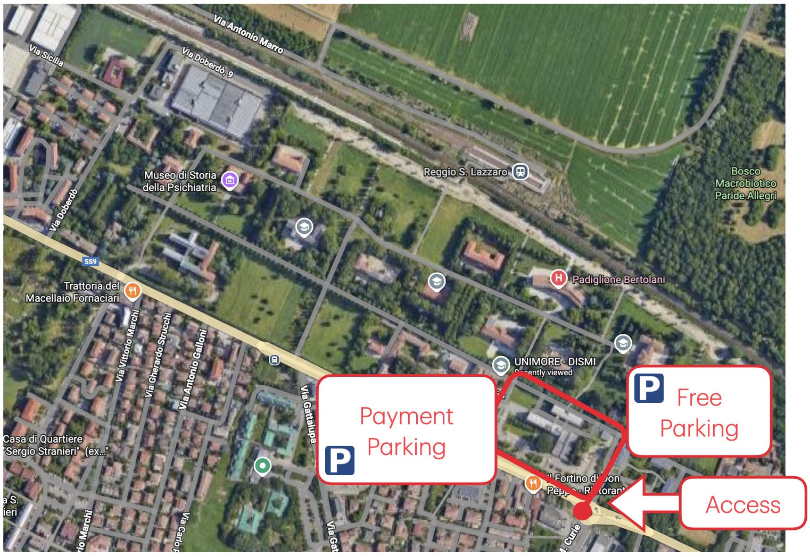
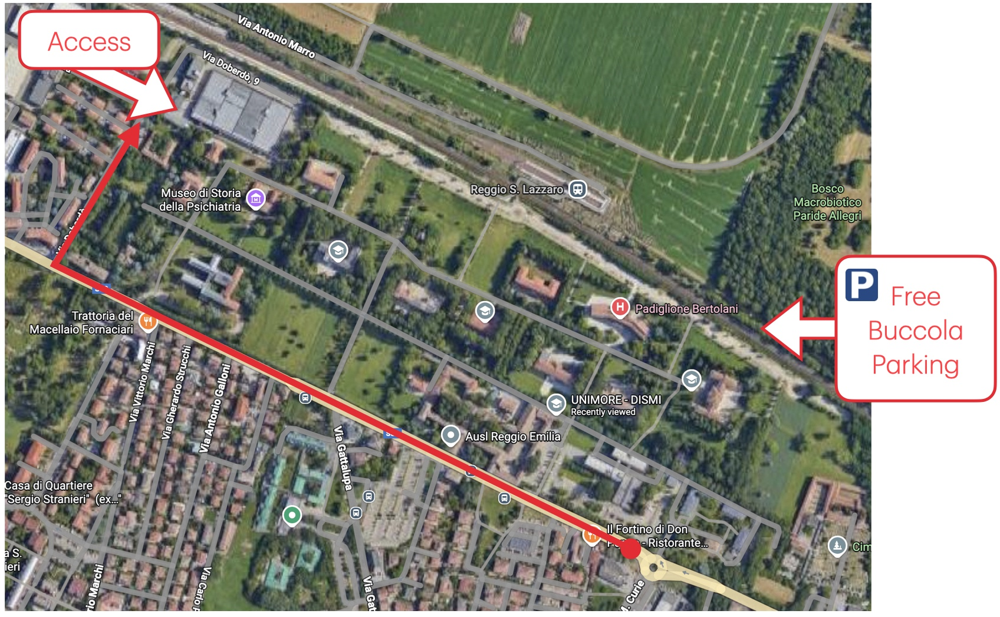

# DIPI Research Group - Public Information

## 🗺️ Where are we ?

The DIPI group is at the **Department of Sciences and Methods for Engineering (DISMI)** of the **University of Modena and Reggio Emilia**. The main address of the department is:

📍 **Department of Sciences and Methods for Engineering**
University of Modena and Reggio Emilia
via Giovanni Amendola 2,
42122 Reggio Emilia (Italy)

🎯 **Google Maps**: [Link](https://maps.app.goo.gl/tUapSHFCUPhDwwxq9)

## How to reach us ?

✈️ **Plane** The nearest airport is the **Airport of Bologna Guglielmo Marconi** with frequent direct connections to all major European Hubs (Milan, Rome, Frankfurt, Brussels, Paris, London, Amsterdam). From the airport, a shuttle is available to reach the train station.

🚂 **Train** You can go to www.raileurope.com to discover how to reach Reggio Emilia. From the railway station you can catch the bus.

🚗 **Car** If you travel by car, you can reach Reggio Emilia with the A1 Motorway.

## 🏡 The Area of Campus San Lazzaro

DISMI & DIPI Research Group facilities, building and officies are located in the **Campus San Lazzaro** area, in the South-West part of Reggio Emilia. 

### 🏫 Buildings

The three main buildings where our group is active are:

- 📍 **Morselli Building**: Offices
  - Coordinates: 44.6875743421086, 10.66722036545739
  - Google Maps: [Link](https://maps.app.goo.gl/JuER392BpPPFgC2U7)
- 📍 **Buccola Building**: Lecture halls and meeting rooms
  - Coordinates: 44.68773156965915, 10.668747020856296
  - Google Maps: [Link](https://maps.app.goo.gl/qczm4jtuzMR3dZu29)
- 📍 **Tamburini Building**: Lecture halls and laboratories
  - Coordinates: 44.688487270317644, 10.664930382359026
  - Google Maps: [Link](https://maps.app.goo.gl/oqCqDxAipEzzRGRN7)

### 🅿️ Parking Areas

There are three main parking options available for visitors:

- **Via Emilia Parking Areas** (near Morselli Building):
    - Free parking available accessing from Via Emilia Ospizio and via Giovanni Amendola 2.
    - Paid parking available in Via Emilia Ospizio accessing from Via Emilia Ospizio and via Giovanni Amendola 2.

- **Buccola Building Parking Area**:
    - Free parking available accessing from Via Doberdò.

Please refer to the campus maps and images above for the exact locations of each parking area.

For accessing the parking close to the Morselli building you can follow the instructions depicted in the following image and following Via Emilia until the intersection with San Lazzaro roundabout.

In order to access the Buccola Parking Area, you can follow the instructions depicted in the following image and following Via Emilia until the intersection with Via Doberdò

